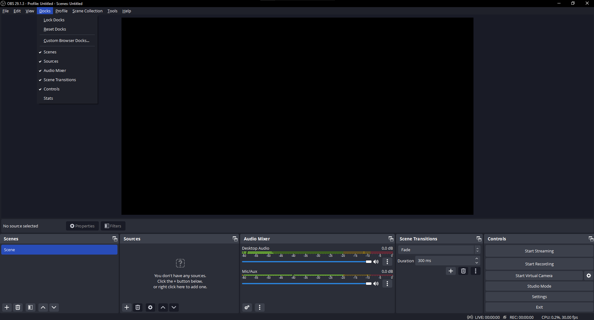
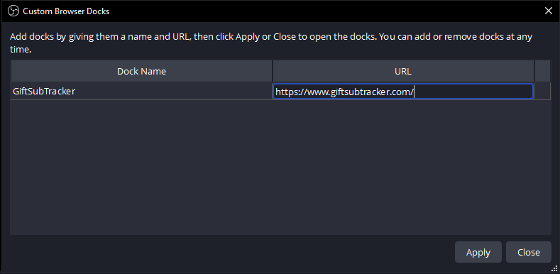

<div id="top"></div>

<!-- PROJECT SHIELDS -->
[![Contributors][contributors-shield]][contributors-url]
[![Forks][forks-shield]][forks-url]
[![Stargazers][stars-shield]][stars-url]
[![Issues][issues-shield]][issues-url]
[![MIT License][license-shield]][license-url]
[![LinkedIn][linkedin-shield]][linkedin-url]

<!-- PROJECT LOGO -->
<br />
<div align="center">
  <a href="https://github.com/brandondunbar/GiftSubTracker">
    
  </a>

<h3 align="center">Gift Sub Tracker</h3>

  <p align="center">
    A website that enables Twitch streamers to track gifted subs and reward viewers accordingly.
    <br />
    <a href="https://github.com/brandondunbar/GiftSubTracker/Wiki"><strong>Explore the docs »</strong></a>
    <br />
    <br />
    <a href="https://www.GiftSubTracker.com/">View Site</a>
    ·
    <a href="https://github.com/brandondunbar/GiftSubTracker/issues">Report Bug</a>
    ·
    <a href="https://github.com/brandondunbar/GiftSubTracker/issues">Request Feature</a>
  </p>
</div>


<!-- TABLE OF CONTENTS -->
<details>
  <summary>Table of Contents</summary>
  <ol>
    <li>
      <a href="#about-the-project">About The Project</a>
      <ul>
        <li><a href="#built-with">Built With</a></li>
      </ul>
    </li>
    <li>
      <a href="#getting-started">Getting Started</a>
    </li>
    <li><a href="#usage">Usage</a></li>
    <li><a href="#roadmap">Roadmap</a></li>
    <li><a href="#contributing">Contributing</a></li>
    <li><a href="#license">License</a></li>
    <li><a href="#contact">Contact</a></li>
  </ol>
</details>


<!-- ABOUT THE PROJECT -->
## About The Project

[![Gift Sub Tracker Screen Shot][product-screenshot]](https://www.giftsubtracker.com)

This website provides a table showing viewers who have gifted subs, the number of subs they've gifted, the number of rewards they've been awarded, and a button to allow streamers to track when a reward has been given.

<p align="right">(<a href="#top">back to top</a>)</p>


### Built With

* [Python 3](https://python.org/)
* [Flask](https://flask.palletsprojects.com/en/2.3.x/)
* [Bootstrap](https://getbootstrap.com)
* [JQuery](https://jquery.com)

<p align="right">(<a href="#top">back to top</a>)</p>


<!-- GETTING STARTED -->
## Getting Started

1. Clone the repository to your computer.

`git clone https://www.github.com/brandondunbar/GiftSubTracker`

2. Create a virtual environment

`python3 -m venv venv`

3. Set the virtual env as your source

`source venv/bin/activate`

4. Install the required packages

`python3 -m pip install -r requirements.txt`

5. Create a Google service account and give it the Editor role, so that it can
access Google Sheets.

6. Download the credentials of the service account as JSON, stored in the repository.

7. Create an application using the Twitch Developer Console: [https://dev.twitch.tv/console/apps](https://dev.twitch.tv/console/apps)

7. Create a `.env` file and set your environment variables

```
GCP_PROJECT_ID = "<Project ID of the Google project your service account is held in>"
GCP_KEY_PATH = "<Path to the Service Account Credentials file>"
GOOGLE_APPLICATION_CREDENTIALS = "<Same as GCP_KEY_PATH>"
TWITCH_CLIENT_ID = "<Client ID from the Twitch application>"
TWITCH_CLIENT_SECRET = "<Client Secret from the Twitch application>"
TWITCH_HUB_SECRET = "<Random string>"
FLASK_SIGNING_SECRET = "<Random string>"
```

<p align="right">(<a href="#top">back to top</a>)</p>


<!-- USAGE EXAMPLES -->
## Usage

To set up an OBS Dock, open OBS, navigate to the Docks drop down and select the Custom Browser Docks option:



Add a name for the dock and add the url as shown, then hit apply:



<p align="right">(<a href="#top">back to top</a>)</p>


<!-- ROADMAP -->
## Roadmap

- [ ] Multi-user login
- [ ] Table Sorting
  - [ ] Date tracking

See the [open issues](https://github.com/brandondunbar/GiftSubTracker/issues) for a full list of proposed features (and known issues).

<p align="right">(<a href="#top">back to top</a>)</p>


<!-- CONTRIBUTING -->
## Contributing

Contributions are what make the open source community such an amazing place to learn, inspire, and create. Any contributions you make are **greatly appreciated**.

If you have a suggestion that would make this better, please fork the repo and create a pull request. You can also simply open an issue with the tag "enhancement".
Don't forget to give the project a star! Thanks again!

1. Fork the Project
2. Create your Feature Branch (`git checkout -b feature/AmazingFeature`)
3. Commit your Changes (`git commit -m 'Add some AmazingFeature'`)
4. Push to the Branch (`git push origin feature/AmazingFeature`)
5. Open a Pull Request

<p align="right">(<a href="#top">back to top</a>)</p>


<!-- LICENSE -->
## License

Distributed under the Creative Commons License. See `LICENSE` for more information.

<p align="right">(<a href="#top">back to top</a>)</p>


<!-- CONTACT -->
## Contact

Brandon Dunbar - brandon.dunbar97@gmail.com

Project Link: [https://github.com/brandondunbar/GiftSubTracker](https://github.com/brandondunbar/GiftSubTracker)

<p align="right">(<a href="#top">back to top</a>)</p>

<!-- MARKDOWN LINKS & IMAGES -->
<!-- https://www.markdownguide.org/basic-syntax/#reference-style-links -->
[contributors-shield]: https://img.shields.io/github/contributors/brandondunbar/GiftSubTracker.svg?style=for-the-badge
[contributors-url]: https://github.com/brandondunbar/GiftSubTracker/graphs/contributors
[forks-shield]: https://img.shields.io/github/forks/brandondunbar/GiftSubTracker.svg?style=for-the-badge
[forks-url]: https://github.com/brandondunbar/GiftSubTracker/network/members
[stars-shield]: https://img.shields.io/github/stars/brandondunbar/GiftSubTracker.svg?style=for-the-badge
[stars-url]: https://github.com/brandondunbar/GiftSubTracker/stargazers
[issues-shield]: https://img.shields.io/github/issues/brandondunbar/GiftSubTracker.svg?style=for-the-badge
[issues-url]: https://github.com/brandondunbar/GiftSubTracker/issues
[license-shield]: https://img.shields.io/github/license/brandondunbar/GiftSubTracker.svg?style=for-the-badge
[license-url]: https://github.com/brandondunbar/GiftSubTracker/blob/master/LICENSE.txt
[linkedin-shield]: https://img.shields.io/badge/-LinkedIn-black.svg?style=for-the-badge&logo=linkedin&colorB=555
[linkedin-url]: https://www.linkedin.com/in/brandon-dunbar/
[product-screenshot]: images/OBS_Screenshot.png